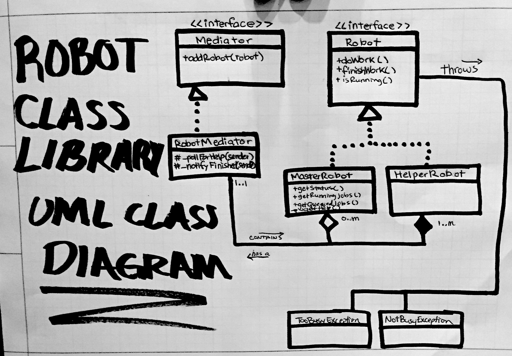

# Robot Class Library #
### Author ###
Denver Smith -- denverpsmith@gmail.com

12/03/2015

### About ###
This is a simple class library that allows robots to perform jobs
or tasks. There are two types of robots: MasterRobots and HelperRobots.
MasterRobots can perform one task at a time, unless they have the help
of a HelperRobot. The MasterRobot keeps a queue of tasks to be performed
if it's already busy. Also, MasterRobots can ask HelperRobots for help
with tasks. A HelperRobot can also only perform one task at a time, and 
will not accept a new task until it's finished.

### Requirements ###
- Python2.7

### Setup ###
1. Clone or download the git repository package: https://github.com/denvaar/RobotClassLibrary
2. Add the ```src``` directory to your PYTHONPATH environment variable.
3. Run the example script: ```python src/driver.py```

### Example Usage ###
```python
from masterRobot import MasterRobot
from helperRobot import HelperRobot
from robotMediator import RobotMediator

# Create a mediator
mediator = RobotMediator()
# Create a master robot and register it with the mediator
master = MasterRobot(mediator) 
# Do the same with the helper
helper = HelperRobot(mediator)

# Assign tasks with doWork() method.
master.doWork()
# Finish tasks with finishWork() method.
master.finishWork()
```
_See driver.py for more examples._

### Design Decisions ###
- __Mediator__ design pattern is used to decouple MasterRobot from HelperRobot. This pattern offers a simple and effective solution to allow these robots to communicate with each other without having to know about each other.
- Both types of robots implement the Robot __interface__. Programming to an interface rather than an implementation is an effective way to decouple the underlying design from the specific implementation. Users may wish to extend the class library to include more types of robots, in which case they may implement the Robot interface.
- __Inheritance__ and __aggregation__ are used among classes.


### Project Structure ###
```src/``` Source code directory.  
```tests/``` Unit tests.  
```doc/``` Documentation directory.  

